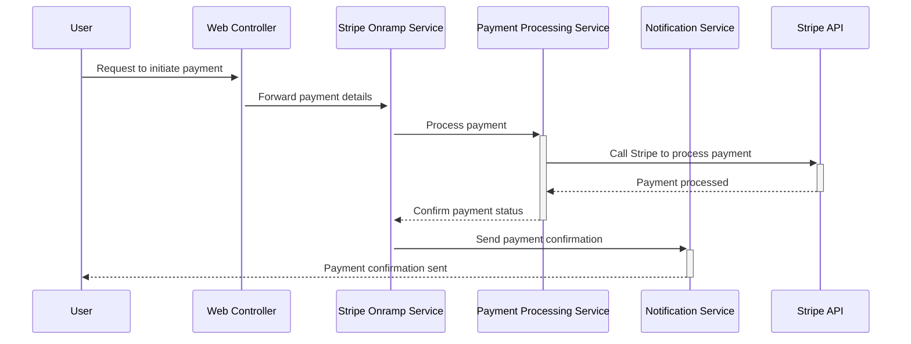

# Integrate with Stripe Onramp

This guide will help you set up a simple page to use Stripe Onramp, including the installation and deployment processes.



## Prerequisites

Before you begin, make sure you have the following installed:
- Python 3
- Pipenv
- Node.js and npm

## Setup Instructions

### Configure Environment Variables

First, set up the necessary environment variables. These variables are essential for running both the server and the client applications.

For the server (Python/Flask):
1. Open your terminal.
2. Run the following command to set the `FLASK_APP` environment variable:
   ```bash
   export FLASK_APP=server.py
   ```

For additional security and functionality, you might need to set more variables (like API keys). Refer to the Stripe documentation for specific variables.

### Install Dependencies

#### Server

1. Navigate to the server directory:
   ```bash
   cd path/to/server
   ```
2. Install Python dependencies:
   ```bash
   pip3 install -r requirements.txt
   pipenv install
   ```

#### Client

1. Navigate to the client directory:
   ```bash
   cd path/to/client
   ```
2. Install Node.js dependencies:
   ```bash
   npm install
   ```

### Run the Applications

#### Server

1. Start the server:
   ```bash
   pipenv run python -m flask run --port=4242
   ```

#### Client

1. Start the client app:
   ```bash
   npm start
   ```

### Access the Application

- Open your web browser and go to [http://localhost:3000](http://localhost:3000) to see your application in action.

## Additional Resources

For more detailed information about integrating with Stripe Onramp, refer to the official [Stripe Documentation](https://stripe.com/docs).
